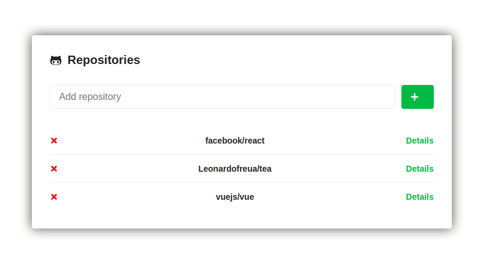
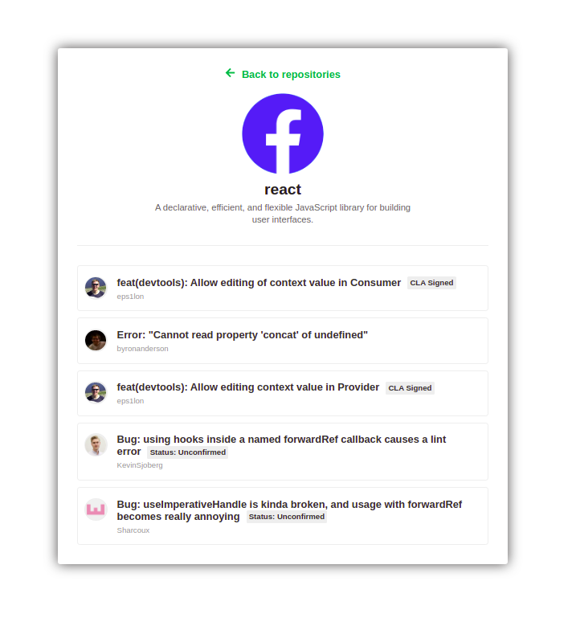

<h1 align="center">
  React Github API
</h1>

<h4 align="center">
  A simple project using some features of React and Github API.
</h4>

  <a href="#-tipics-covered">Topics Covered</a>&nbsp;&nbsp;&nbsp;|&nbsp;&nbsp;&nbsp;
  <a href="#-minidisc-installation">Installation</a>&nbsp;&nbsp;&nbsp;|&nbsp;&nbsp;&nbsp;
  <a href="#-how-to-contribute">How to contribute</a>&nbsp;&nbsp;&nbsp;|&nbsp;&nbsp;&nbsp;
  <a href="#memo-license">License</a>

 

  
  

# Topics covered

This project aims to teach the basic of a `React` project and some functionality of the Github API. Below are topics
covered:

- [Using styled-components](https://github.com/Leonardofreua/react-github-api/commit/0a8999282e92ff1e97b12bed269184b978631ac8)
- [Creating a global styles](https://github.com/Leonardofreua/react-github-api/commit/c44e5c87155fa203db9ba88569195d7bab1cd4a7)
- [Stylizing main page](https://github.com/Leonardofreua/react-github-api/commit/b347122feed7e86c88777a3185d17019ab121a44)
- [Adding a new Repository](https://github.com/Leonardofreua/react-github-api/commit/679875f364f7b101b57979a90560de3ef41fdb20)
- [Listing repositories](https://github.com/Leonardofreua/react-github-api/commit/b0cf1d12b7419488a5023c5a6c0080dac3f4bbd5)
- [Using localstorage to save the repositories](https://github.com/Leonardofreua/react-github-api/commit/10e7b55dace93783133922a6682fa9f14d1c10a3)
- [Route navigation](https://github.com/Leonardofreua/react-github-api/commit/683bc691aab70d5b2bdbf49c41b81e0758c50d49)
- [Removing repositories from the list](https://github.com/Leonardofreua/react-github-api/commit/2d765e510c0481d62eb73a5044358b3895e3947a)
- [Loading when a repository is fetched](https://github.com/Leonardofreua/react-github-api/commit/9483a4b5b69995298efecc61ad101d3cc404828e)
- [Creating PropTypes](https://github.com/Leonardofreua/react-github-api/commit/6a717deb84d926667588479f1f8cae464b3bfa35)
- [Displaying the details of each Repository](https://github.com/Leonardofreua/react-github-api/commit/f3b3c918dc39aef161c329e78bce9284e34ff626)
- [Displaying issues](https://github.com/Leonardofreua/react-github-api/commit/a03e1d0fb5ad869f795c2f0259943238b3abf3dc)

## :minidisc: Installation

- Clone project: `git clone https://github.com/Leonardofreua/react-github-api.git`
- Run: `yarn install`
- Then: `yarn start`

## 🤔 How to contribute

- Fork this repository;
- Create a branch with your feature: `git checkout -b my-feature`;
- Commit your changes: `git commit -m 'feat: My new feature'`;
- Push to your branch: `git push origin my-feature`.

Once your pull request merge is done, you can delete your branch.

## :memo: License

This project is under the MIT license. See [LICENSE](LICENSE) file for more details.
